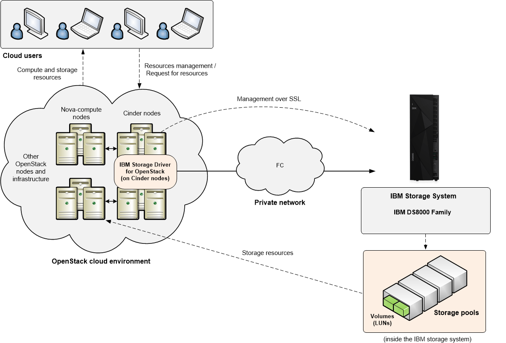

================================
IBM Storage Driver for OpenStack
================================

Introduction
~~~~~~~~~~~~
The IBM Storage Driver for OpenStack is a software component of the
OpenStack cloud environment that enables utilization of storage
resources provided by supported IBM storage systems.

The driver was validated on the following storage systems:

* IBM DS8000 Family
* IBM FlashSystem A9000
* IBM FlashSystem A9000R
* IBM Spectrum Accelerate
* IBM XIV Storage System

After the driver is configured on the OpenStack Cinder nodes, storage volumes
can be allocated by the Cinder nodes to the Nova nodes. Virtual machines on
the Nova nodes can then utilize these storage resources.

.. note::
    Unless stated otherwise, all references to XIV storage
    system in this guide relate all members of the Spectrum Accelerate
    Family (XIV, Spectrum Accelerate and FlashSystem A9000/A9000R).

Concept diagram
---------------
This figure illustrates how an IBM storage system is connected
to the OpenStack cloud environment and provides storage resources when the
IBM Storage Driver for OpenStack is configured on the OpenStack Cinder nodes.
The OpenStack cloud is connected to the IBM storage system over Fibre
Channel or iSCSI (DS8000 systems support only Fibre Channel connections).
Remote cloud users can issue requests for storage resources from the
OpenStack cloud. These requests are transparently handled by the IBM Storage
Driver, which communicates with the IBM storage system and controls the
storage volumes on it. The IBM storage resources are then provided to the
Nova nodes in the OpenStack cloud.

Configuration
~~~~~~~~~~~~~

Configure the driver manually by changing the ``cinder.conf`` file as
follows:

.. code-block:: ini

  volume_driver = cinder.volume.drivers.ibm.ibm_storage.IBMStorageDriver

.. include:: ../../tables/cinder-ibm_storage.inc

Security
~~~~~~~~

The following information provides an overview of security for the IBM
Storage Driver for OpenStack.

Avoiding man-in-the-middle attacks
----------------------------------

When using a Spectrum Accelerate Family product, you can prevent
man-in-the-middle (MITM) attacks by following these rules:

* Upgrade to IBM XIV storage system version 11.3 or later.

* If working in a secure mode, do not work insecurely against another storage
  system in the same environment.

* Validate the storage certificate. If you are using an XIV-provided
  certificate, use the CA file that was provided with your storage system
  (``XIV-CA.pem``). The certificate files should be copied to one of the following
  directories:

    * ``/etc/ssl/certs``
    * ``/etc/ssl/certs/xiv``
    * ``/etc/pki``
    * ``/etc/pki/xiv``

If you are using your own certificates, copy them to the same directories
with the prefix "XIV" and in the ``.pem`` format. For example: XIV-my_cert.pem.

* In order to prevent the CVE-2014-3566 MITM attack, follow the OpenStack
  community directions:
  (http://osdir.com/ml/openstack-dev/2014-10/msg01349.html).

Troubleshooting
~~~~~~~~~~~~~~~

Refer to this information to troubleshoot technical problems that you
might encounter when using the IBM Storage Driver for OpenStack.

Checking the Cinder node log files
----------------------------------

The Cinder log files record operation information that might be useful
for troubleshooting.

To achieve optimal and clear logging of events, activate the verbose
logging level in the cinder.conf file, located in the ``/etc/cinder``
folder. Add the following line in the file, save the file, and then
restart the cinder-volume service:

.. code-block:: console

    verbose = True
    debug = True

To turn off the verbose logging level, change ``True`` to ``False``,
save the file, and then restart the cinder-volume service.

Check the log files on a periodic basis to ensure that the IBM
Storage Driver is functioning properly.

To check the log file on a Cinder node:
Go to the /var/log/cinder folder and open the activity log file named
cinder-volume.log or volume.log. The IBM Storage Driver writes to this
log file using the [IBM DS8K STORAGE] or [IBM XIV STORAGE] prefix
(depending on the relevant storage system) for each event that it
records in the file.

Best practices
~~~~~~~~~~~~~~

This section contains the general guidance and best practices.

Working with multi-tenancy
--------------------------
The XIV storage systems, running microcode version 11.5 or later, Spectrum
Accelerate and FlashSystem A9000/A9000R can employ multi-tenancy.

In order to use multi-tenancy with the IBM Storage Driver for OpenStack:

* For each storage system, verify that all predefined storage pools are
  in the same domain or, that all are not in a domain.

* Use either storage administrator or domain administrator user's
  credentials, as long as the credentials grant a full access to the relevant
  pool.
* If the user is a domain administrator, the storage system domain
  access policy can be CLOSED (``domain_policy: access=CLOSED``).
  Otherwise, verify that the storage system domain access policy is
  OPEN (``domain_policy: access=OPEN``).
* If the user is not a domain administrator, the host management policy
  of the storage system domain can be BASIC (``domain_policy:
  host_management=BASIC``). Otherwise, verify that the storage
  system domain host management policy is EXTENDED
  (``domain_policy: host_management=EXTENDED``).

Working with IBM Real-time Compression™
---------------------------------------
XIV storage systems running microcode version 11.6 or later,
Spectrum Accelerate and FlashSystem A9000/A9000R can employ IBM
Real-time Compression™.

Follow these guidelines when working with compressed storage
resources using the IBM Storage Driver for OpenStack:

* Compression mode cannot be changed for storage volumes, using
  the IBM Storage Driver for OpenStack. The volumes are created
  according to the default compression mode of the pool. For example,
  any volume created in a compressed pool will be compressed as well.

* The minimum size for a compressed storage volume is 87 GB.

Working with QoS
----------------
The IBM Storage Driver for OpenStack provides QoS per volume for
IBM FlashSystem A9000/A9000R storage systems, running microcode
version of 12.0 or later. With QoS classes, the user can control
the maximum bandwidth and I/O operations for each volume.

See IBM Spectrum Accelerate Family Storage Configuration and Usage
for IBM FlashSystem A9000, IBM FlashSystem A9000R and IBM XIV Gen3,
SG24-8376 for information about how to set QoS by defining
performance classes in terms of IOPS and bandwidth limitation

QoS class types:

* Shared (default). Limits the combined rates of all of the volumes
  in the same QoS class. The maximum rate is the sum of the
  combined rate for each volume. For example, two volumes under
  a QoS class of maximum 100 Gbps are allocated a combined
  maximum bandwidth rate of 100 Gbps.

* Independent. Sets the maximum rate separately for each volume
  in the QoS class. For example, for two volumes under a QoS
  class of maximum 100 Gbps, each volume is limited to a rate
  of 100 Gbps. Thus, the combined maximum bandwidth rate is up
  to 200 Gbps.

To define a QoS class:

 1. Create the QoS class:

    .. code-block:: console

         cinder qos-create <class_name> <class_specs: bw=#, iops=#>

 2. Create a type:

    .. code-block:: console

        cinder type-create type_<qos_class_name>

 3. Associate the QoS class with the type:

    .. code-block:: console

        cinder qos-associate <qos uuid> <type uuid>

 4. Announce that the type is supporting QoS:

    .. code-block:: console

        cinder type-key <type_name or UUID> set QoS_support=True

 5. Create a volume:

    .. code-block:: console

        cinder create 1 --volume-type <type_name>

