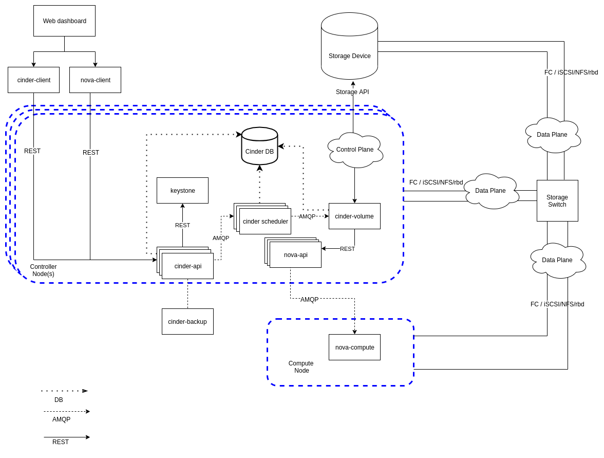

..
      Copyright 2010-2011 United States Government as represented by the
      Administrator of the National Aeronautics and Space Administration.
      All Rights Reserved.

      Licensed under the Apache License, Version 2.0 (the "License"); you may
      not use this file except in compliance with the License. You may obtain
      a copy of the License at

          http://www.apache.org/licenses/LICENSE-2.0

      Unless required by applicable law or agreed to in writing, software
      distributed under the License is distributed on an "AS IS" BASIS, WITHOUT
      WARRANTIES OR CONDITIONS OF ANY KIND, either express or implied. See the
      License for the specific language governing permissions and limitations
      under the License.

Cinder System Architecture
==========================

The Cinder Block Storage service provides persistent block storage for
OpenStack clouds.  A deployment is composed of several cooperating services
that share a database and communicate through RPC.

Cinder uses a SQL-based central database that is shared by all Cinder services
in the system.  Services use the database for durable resource state and use
RPC to coordinate work that must be performed by another service.

Components
----------

Below you will find a brief explanation of the different components.

..

DB
    SQL database for durable resource state.  It is used by all Cinder
    services, though not every relationship is shown in the diagram.

API
    The ``cinder-api`` service receives HTTP requests, validates input,
    applies policy, records initial state, and coordinates work with other
    Cinder services.  API contract changes may require a new microversion; see
    :doc:`api_microversion_dev`.

Scheduler
    The ``cinder-scheduler`` service selects a suitable backend for operations
    such as volume creation.  It considers backend capabilities, filters, and
    weighers.

Volume
    The ``cinder-volume`` service manages volumes on storage backends through
    Cinder volume drivers.  Driver changes should follow :doc:`drivers` and
    :doc:`new_driver_checklist`.

Backup
    The ``cinder-backup`` service manages volume backups independently from
    volume drivers.  Backup drivers provide access to backup repositories.

Dashboard and clients
    Horizon, command-line clients, SDKs, and other services call the Cinder
    API.  These are external to the Cinder service deployment.

Auth
    Authentication and authorization are integrated with Keystone and Cinder
    policy.  Policy definitions live under ``cinder/policies/``.

Service interaction example
---------------------------

A typical volume creation request crosses several services:

#. A user or service sends a volume create request to ``cinder-api``.
#. The API service validates the request, applies policy, and creates an
   initial database record.
#. The API service asks ``cinder-scheduler`` to choose a backend.
#. The scheduler evaluates backend state and sends the request to a selected
   ``cinder-volume`` service.
#. The volume service calls the storage backend through the configured driver.
#. The volume service updates the database with the final volume state.

This example is intentionally simplified.  Many operations also involve quotas,
conditional database updates, versioned objects, attachment records, or rolling
upgrade compatibility constraints.  See the focused contributor documents for
those topics.

Related documents
-----------------

* :doc:`repo-overview` for a repository layout map.
* :doc:`rpc` for service communication concepts.
* :doc:`threading` for Cinder's eventlet and green-thread model.
* :doc:`api_conditional_updates` for race-safe database state updates.
* :doc:`attach_detach_conventions` and :doc:`attach_detach_conventions_v2` for
  attachment flows.
* :doc:`rolling.upgrades` for upgrade compatibility requirements.
* :doc:`database-migrations` for schema and migration guidance.
